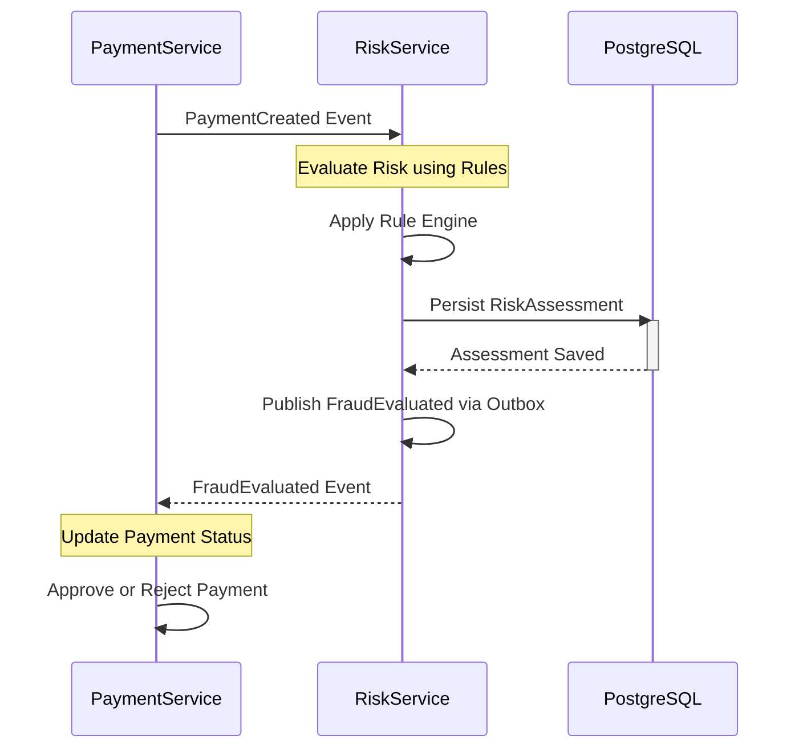
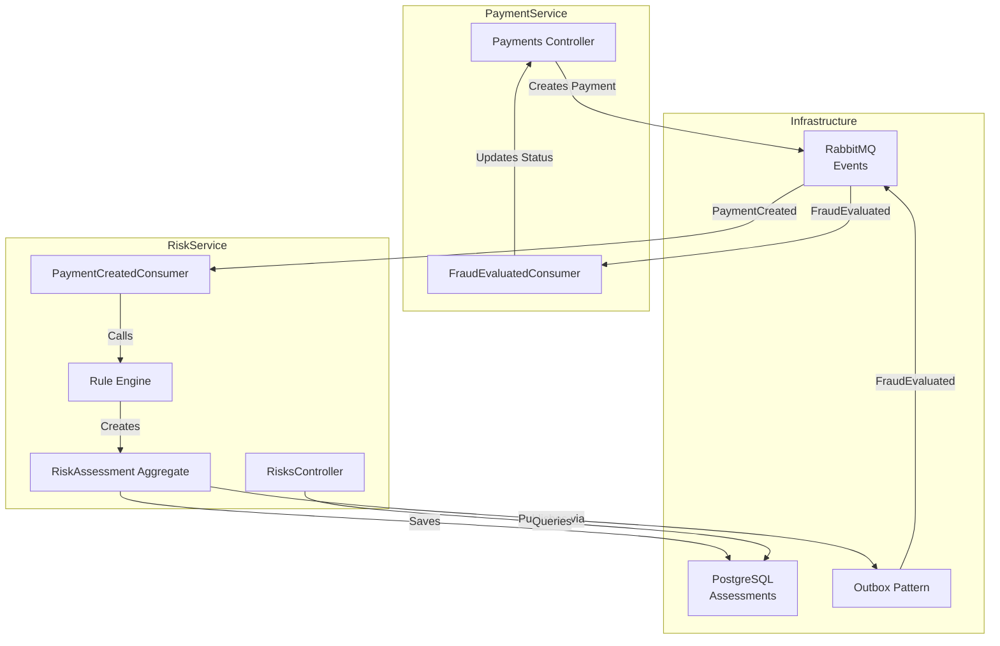
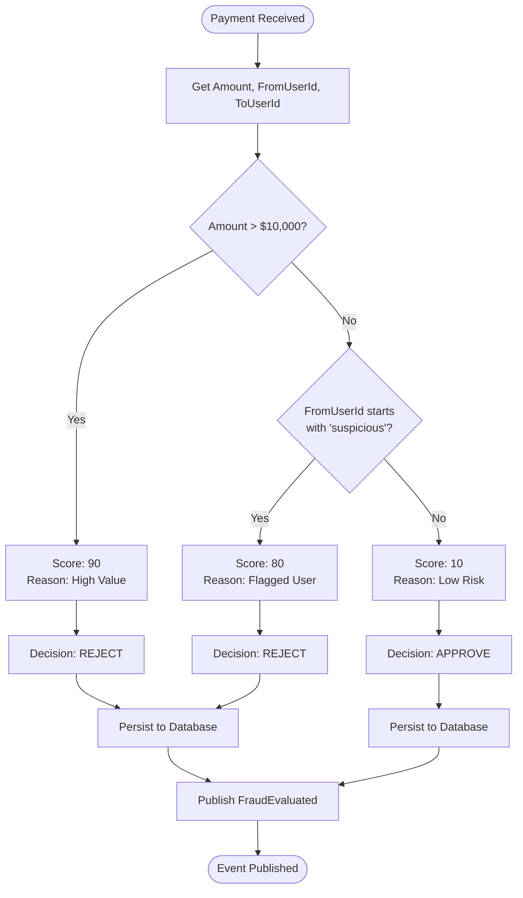
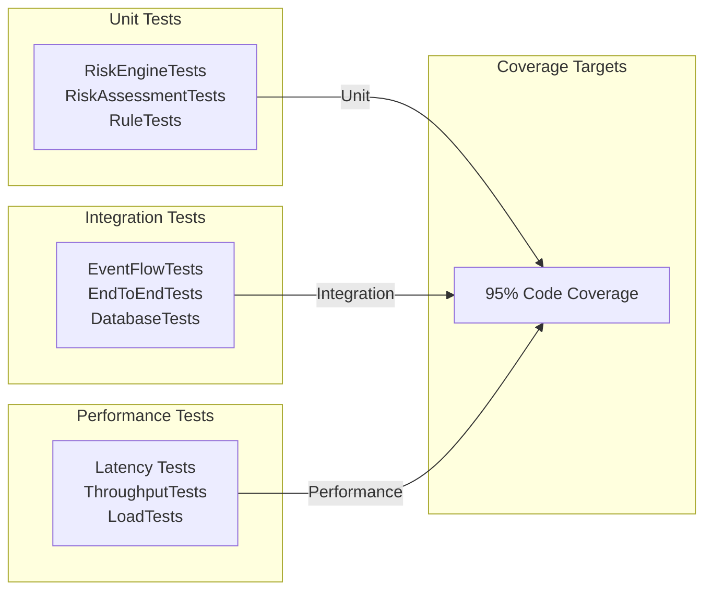

# Risk Service - Design Document

## 1. Overview

The Risk Service is responsible for evaluating the fraud risk of all financial transactions within the MercuryPay platform. It acts as a gatekeeper, analyzing payment requests in real-time and providing actionable decisions (Approve/Reject/Review) based on configurable rules and historical data.

## 2. User Stories

- **US-RISK-01**: As a compliance officer, I want all payments to be automatically screened for high-risk patterns so that fraud is prevented.
- **US-RISK-02**: As a system, I want to store the results of every risk assessment so that we maintain an audit trail for regulatory compliance.
- **US-RISK-03**: As a developer, I want to query past risk decisions by Payment ID so that I can debug transaction flows.

## 3. Domain Model

### Aggregates

- **RiskAssessment**: The core entity representing the outcome of a risk evaluation.
  - **Id**: Unique identifier (UUID).
  - **PaymentId**: The ID of the payment being evaluated.
  - **RiskScore**: Integer (0-100), where 100 indicates maximum risk.
  - **IsApproved**: Boolean decision flag.
  - **Reason**: Human-readable explanation for the decision (e.g., "High Value Transaction").
  - **CreatedAt**: Timestamp of the evaluation.

### Events

- **FraudEvaluated**: Published after a risk assessment is completed and persisted.
  - Contains: `PaymentId`, `IsApproved`, `RiskScore`, `Reason`.
  - Consumers: Payment Service (to update payment status).

## 4. Technical Implementation Details

### Persistence Layer

The service uses **PostgreSQL** with **Entity Framework Core** for data persistence.

- **Schema**: A `RiskAssessments` table stores all evaluation results.
- **Transactional Consistency**: The service employs the **Outbox Pattern** (via MassTransit) to ensure that the `FraudEvaluated` event is only published if the assessment is successfully saved to the database. This prevents "phantom" events where a decision is communicated but not recorded.

### Rule Engine (v1 - Simple)

The initial implementation uses a hardcoded rule set for simplicity:

1. **High Value**: Transactions > $10,000 are rejected (Score: 90).
2. **Suspicious User**: Users with IDs starting with "suspicious" are rejected (Score: 80).
3. **Default**: All other transactions are approved (Score: 10).

### Event Flow

1. **Consume**: Listens for `PaymentCreated` events from the Payment Service.
2. **Evaluate**: Applies the rule engine to the payment details.
3. **Persist**: Saves the `RiskAssessment` to the database.
4. **Publish**: Emits a `FraudEvaluated` event using the transactional outbox.

## 5. API Specification

### 5.1 Risk Assessment Query

**Endpoint**: `GET /risks/{paymentId}`

- **Description**: Retrieve the risk assessment for a specific payment.
- **Request**: None
- **Response**: `200 OK`

```json
{
  "id": "uuid",
  "paymentId": "uuid",
  "riskScore": 45,
  "isApproved": true,
  "reason": "Low Risk",
  "createdAt": "2026-03-09T10:30:00Z"
}
```

- **Response**: `404 Not Found` if assessment doesn't exist.

### 5.2 List Risk Assessments (Pagination)

**Endpoint**: `GET /risks?page=1&pageSize=10`

- **Description**: List all risk assessments with pagination.
- **Request**: Query parameters
  - `page` (optional, default: 1)
  - `pageSize` (optional, default: 10)

- **Response**: `200 OK`

```json
{
  "totalCount": 1250,
  "page": 1,
  "pageSize": 10,
  "assessments": [
    {
      "id": "uuid",
      "paymentId": "uuid",
      "riskScore": 75,
      "isApproved": false,
      "reason": "Flagged User",
      "createdAt": "2026-03-09T10:25:00Z"
    }
  ]
}
```

## 6. Event-Driven Architecture

### 6.1 Event Flow Diagram



### 6.2 System Architecture Components



### 6.3 Event Contracts

**PaymentCreated** (Published by PaymentService)

```json
{
  "paymentId": "uuid",
  "fromUserId": "string",
  "toUserId": "string",
  "amount": 100.00,
  "currency": "USD",
  "timestamp": "2026-03-09T10:20:00Z"
}
```

**FraudEvaluated** (Published by RiskService)

```json
{
  "paymentId": "uuid",
  "isApproved": true,
  "riskScore": 15,
  "reason": "Low Risk",
  "timestamp": "2026-03-09T10:20:05Z"
}
```

## 7. Requirements Traceability Matrix (RTM)

| Req ID | Description | Type | Priority | Test Case ID | Status |
| --- | --- | --- | --- | --- | --- |
| REQ-RISK-001 | Consume PaymentCreated Events | Functional | P1 | TEST-RISK-001 | Implemented |
| REQ-RISK-002 | Evaluate Risk Using Rules | Functional | P1 | TEST-RISK-002 | Implemented |
| REQ-RISK-003 | Persist Assessment to Database | Functional | P1 | TEST-RISK-003 | Implemented |
| REQ-RISK-004 | Publish FraudEvaluated Event | Functional | P1 | TEST-RISK-004 | Implemented |
| REQ-RISK-005 | Guarantee Event Atomicity (Outbox) | Functional | P1 | TEST-RISK-005 | Implemented |
| REQ-RISK-006 | Query Risk Assessment by PaymentId | Functional | P2 | TEST-RISK-006 | Pending |
| REQ-RISK-007 | List Assessments with Pagination | Functional | P2 | TEST-RISK-007 | Pending |
| REQ-RISK-008 | Generate Risk Audit Trail | Non-Functional | P2 | TEST-RISK-008 | Pending |
| NFR-RISK-001 | Risk Evaluation < 100ms | Non-Functional | P2 | PERF-RISK-001 | Pending |
| NFR-RISK-002 | 99.9% Event Delivery Guarantee | Non-Functional | P2 | REL-RISK-001 | Implemented |

## 8. Rule Engine Specification (v1)

### 8.1 Current Rules

| Rule # | Name | Condition | Action | Risk Score |
| --- | --- | --- | --- | --- |
| R1 | High Value | amount > 10,000 | REJECT | 90 |
| R2 | Suspicious User | fromUserId.StartsWith("suspicious") | REJECT | 80 |
| R3 | Default Low Risk | (any other) | APPROVE | 10 |

### 8.2 Rule Evaluation Engine Flow



### 8.3 Future Enhancement: Rule Priority System

**Planned for v2:**

- Add weight-based scoring: Each rule contributes to score (not binary)
- Blacklist/Whitelist integration: User history checking
- Velocity checks: Frequency of transactions
- Geographic risk: Location-based analysis

## 9. Testing Strategy

### 9.1 Test Coverage Overview



### 9.2 Unit Tests

- ✅ RiskAssessment.Evaluate() with various input scenarios
- ✅ PaymentCreatedConsumer event handling
- ✅ High-value transaction rejection
- ✅ Suspicious user detection
- ✅ Rule engine decision logic (all branches)
- ✅ Boundary condition testing (at/above threshold)

### 9.3 Integration Tests (TODO)

- [ ] Full event flow: PaymentCreated → Risk Evaluation → FraudEvaluated
- [ ] Database persistence and Outbox atomicity
- [ ] Risk assessment queries via API
- [ ] Pagination correctness
- [ ] Statistics endpoint validation

### 9.4 Performance Tests (TODO)

- [ ] Risk evaluation < 100ms latency
- [ ] Concurrent event processing (100+ TPS)
- [ ] Database query performance (1000+ assessments)
- [ ] Memory usage under sustained load
