# MercuryPay - Complete Architecture Diagrams

---

## Diagram 1: High-Level System Context (C4 - Level 1)

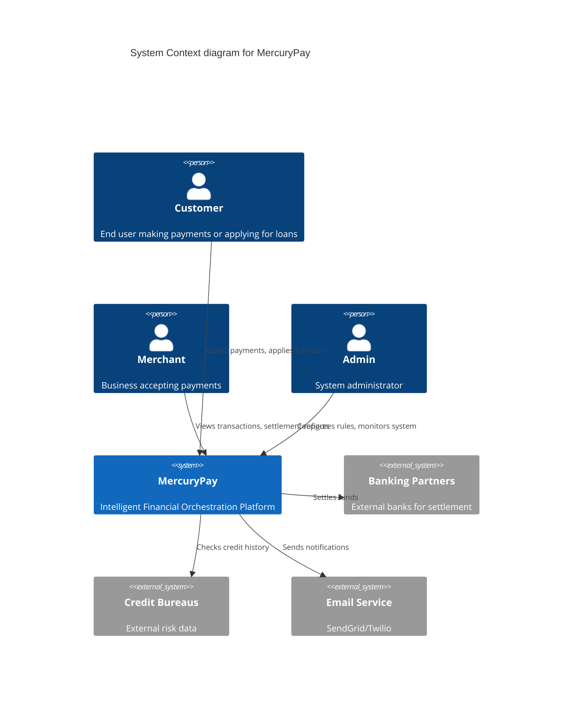

---

## Diagram 2: Container Diagram (C4 - Level 2)

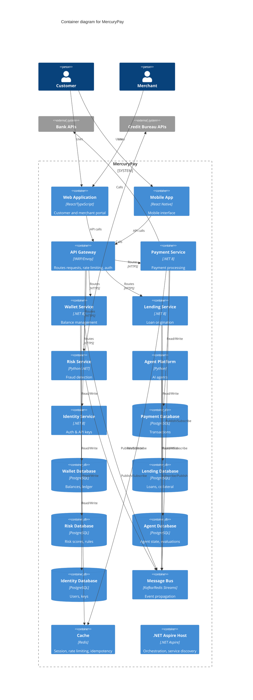

---

## Diagram 3: Deployment Architecture (Azure)

```mermaid
graph TB
    subgraph "Azure Cloud"
        subgraph "AKS Cluster"
            subgraph "Namespace: mercury-pay"
                PG[Payment Service Pod]
                WG[Wallet Service Pod]
                LG[Lending Service Pod]
                RG[Risk Service Pod]
                AG[Agent Platform Pod]
                IG[Identity Service Pod]
                GW[API Gateway Pod]
            end
            
            subgraph "Aspire Control Plane"
                AH[Aspire Host]
                SD[Service Discovery]
                OT[OpenTelemetry Collector]
            end
        end
        
        subgraph "Azure Managed Services"
            Redis[Azure Cache for Redis]
            
            subgraph "Azure Database for PostgreSQL"
                PDB[(Payment DB)]
                WDB[(Wallet DB)]
                LDB[(Lending DB)]
                RDB[(Risk DB)]
                ADB[(Agent DB)]
                IDB[(Identity DB)]
            end
            
            EH[Azure Event Hubs] 
            K8s[AKS]
            KV[Azure Key Vault]
            Monitor[Azure Monitor]
        end
        
        subgraph "Front Door"
            AFD[Azure Front Door]
            WAF[WAF Policy]
        end
        
        subgraph "CDN"
            CDN[Azure CDN]
        end
    end
    
    subgraph "External"
        Users[Users/Merchants]
        Banks[Banking Partners]
        Credit[Credit Bureaus]
    end
    
    Users --> AFD
    AFD --> WAF
    WAF --> GW
    GW --> PG & WG & LG & RG & AG & IG
    
    PG --> PDB
    WG --> WDB
    LG --> LDB
    RG --> RDB
    AG --> ADB
    IG --> IDB
    
    PG --> Redis
    WG --> Redis
    
    PG --> EH
    WG --> EH
    LG --> EH
    RG --> EH
    AG --> EH
    
    PG --> Banks
    RG --> Credit
    
    AH --> PG & WG & LG
    OT --> Monitor
    
    KV --> PG
    KV --> WG
    KV --> LG
```

---

## Diagram 4: Bounded Contexts & Event Flow

```mermaid
flowchart TB
    subgraph "Payment Context"
        direction TB
        P1[Payment Aggregate] --> PE1[PaymentInitiated]
        P1 --> PE2[PaymentAuthorized]
        P1 --> PE3[PaymentCaptured]
        P1 --> PE4[PaymentRefunded]
    end
    
    subgraph "Wallet Context"
        direction TB
        W1[Wallet Aggregate] --> WE1[WalletCredited]
        W1 --> WE2[WalletDebited]
        W1 --> WE3[HoldPlaced]
        W1 --> WE4[HoldReleased]
    end
    
    subgraph "Lending Context"
        direction TB
        L1[Loan Aggregate] --> LE1[LoanApplicationSubmitted]
        L1 --> LE2[LoanApproved]
        L1 --> LE3[LoanDisbursed]
        L1 --> LE4[RepaymentReceived]
    end
    
    subgraph "Risk Context"
        direction TB
        R1[RiskAssessment] --> RE1[PaymentRiskAssessed]
        R1 --> RE2[LoanRiskAssessed]
        R1 --> RE3[FraudDetected]
    end
    
    subgraph "Agent Context"
        direction TB
        A1[FraudAgent]
        A2[RetryAgent]
        A3[ReconciliationAgent]
        A4[CostOptimizationAgent]
    end
    
    subgraph "Event Bus"
        EB[(Kafka/Redis Streams)]
    end
    
    Payment Context --> EB
    Wallet Context --> EB
    Lending Context --> EB
    Risk Context --> EB
    
    EB --> Payment Context
    EB --> Wallet Context
    EB --> Lending Context
    EB --> Risk Context
    EB --> Agent Context
    
    Agent Context --> EB
```

---

## Diagram 5: Payment Flow Sequence (Event-Driven)

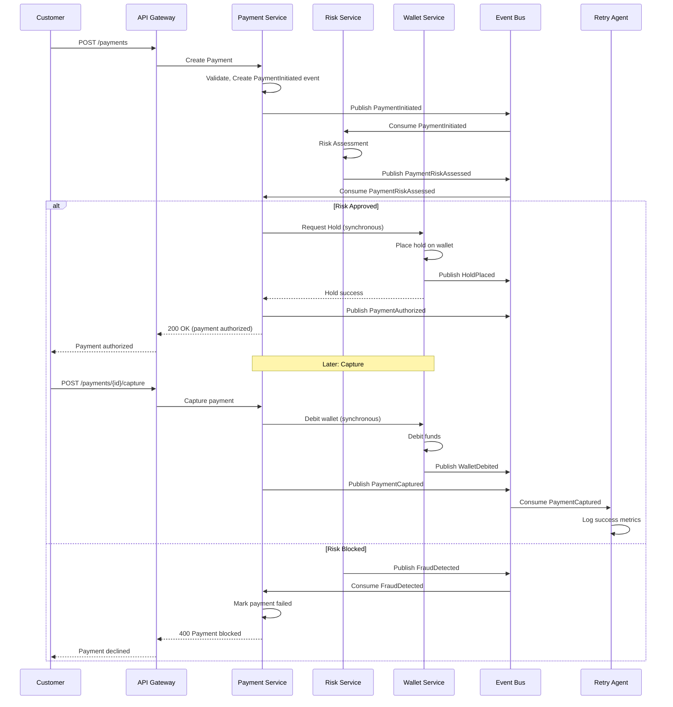

---

## Diagram 6: Loan Origination Saga (Process Manager Pattern)

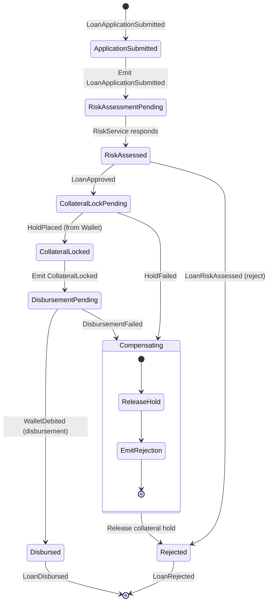

---

## Diagram 7: Multi-Agent System Architecture

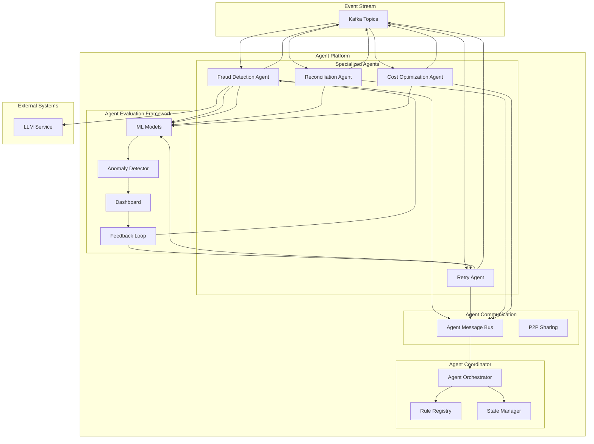

---

## Diagram 8: Agent Collaboration - Retry with Fallback

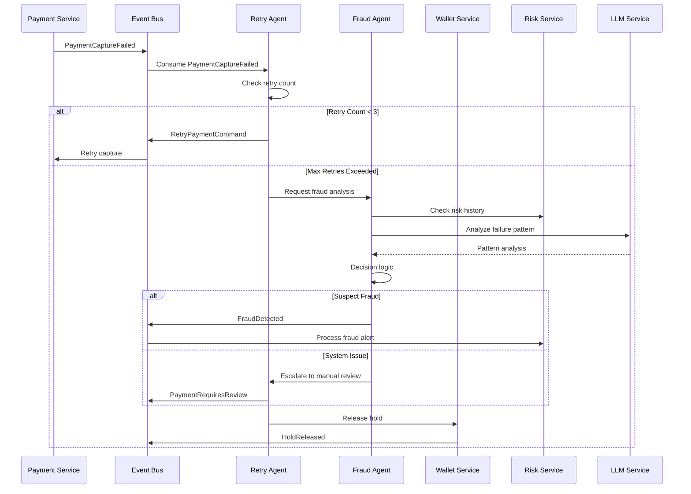

---

## Diagram 9: CQRS + Event Sourcing Pattern (Payment Service)

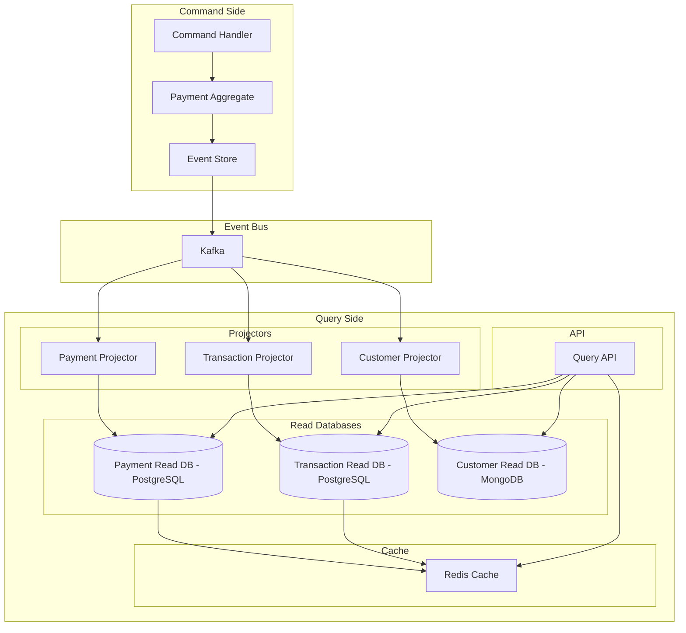

---

## Diagram 10: .NET Aspire Orchestration

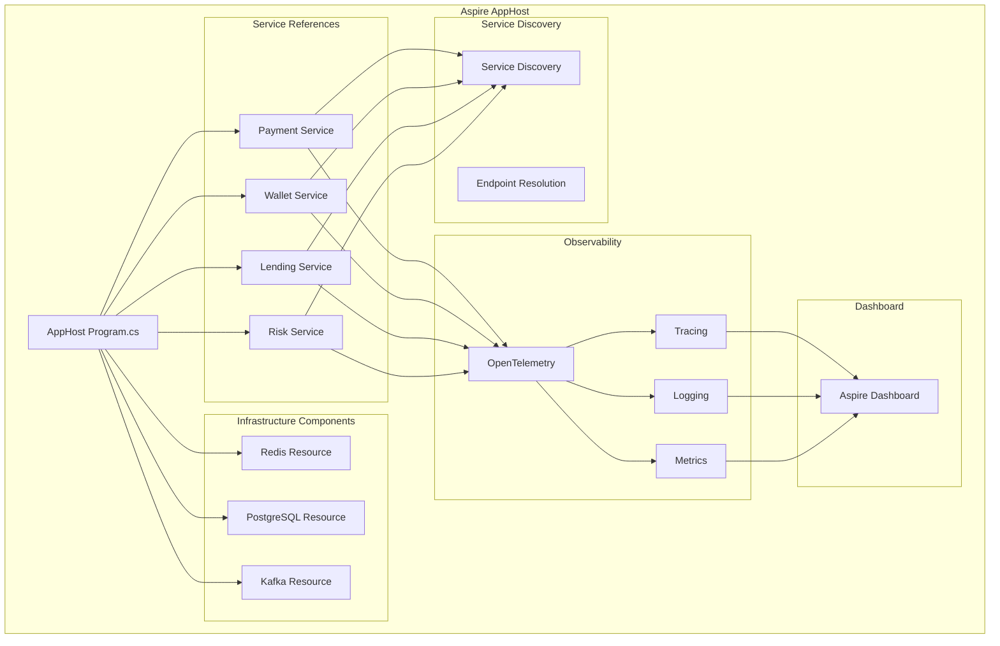

---

## Diagram 11: Database Replication & High Availability

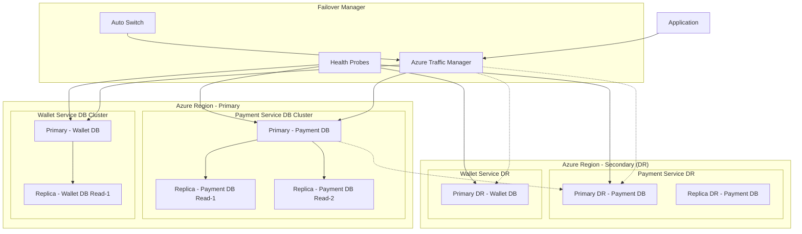

---

## Diagram 12: Security Architecture

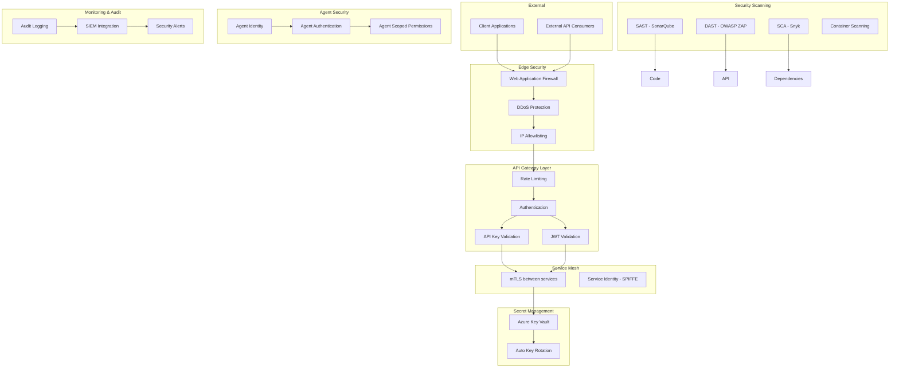

---

## Diagram 13: CI/CD Pipeline

```mermaid
graph LR
    subgraph "Source"
        Git[GitHub Repository]
        PR[Pull Request]
    end
    
    subgraph "CI Pipeline"
        Build[Build]
        Unit[Unit Tests]
        SAST[SAST Scan]
        SCA[SCA Scan]
        Container[Container Build]
        Registry[Container Registry]
    end
    
    subgraph "CD Pipeline - Dev"
        DeployDev[Deploy to Dev]
        IntTests[Integration Tests]
        Contract[Contract Tests]
    end
    
    subgraph "CD Pipeline - Staging"
        DeployStg[Deploy to Staging]
        E2E[E2E Tests]
        Perf[Performance Tests]
        DAST[DAST Scan]
    end
    
    subgraph "CD Pipeline - Prod"
        Approval[Manual Approval]
        DeployProd[Deploy to Production]
        Smoke[Smoke Tests]
        Monitor[Monitoring]
    end
    
    Git --> PR
    PR --> Build
    Build --> Unit
    Unit --> SAST
    SAST --> SCA
    SCA --> Container
    Container --> Registry
    
    Registry --> DeployDev
    DeployDev --> IntTests
    IntTests --> Contract
    Contract --> DeployStg
    
    DeployStg --> E2E
    E2E --> Perf
    Perf --> DAST
    DAST --> Approval
    
    Approval --> DeployProd
    DeployProd --> Smoke
    Smoke --> Monitor
```

---

## Diagram 14: Observability Stack

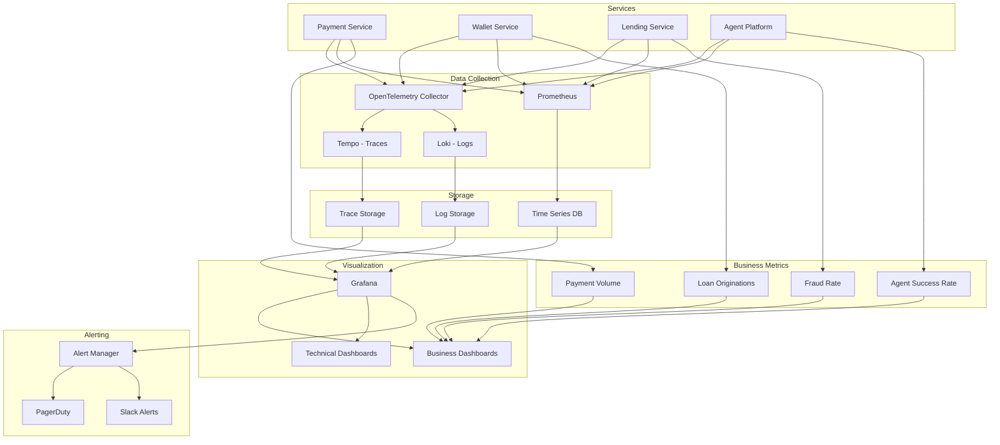

---
