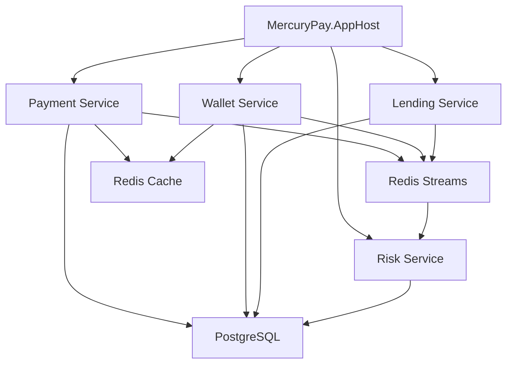
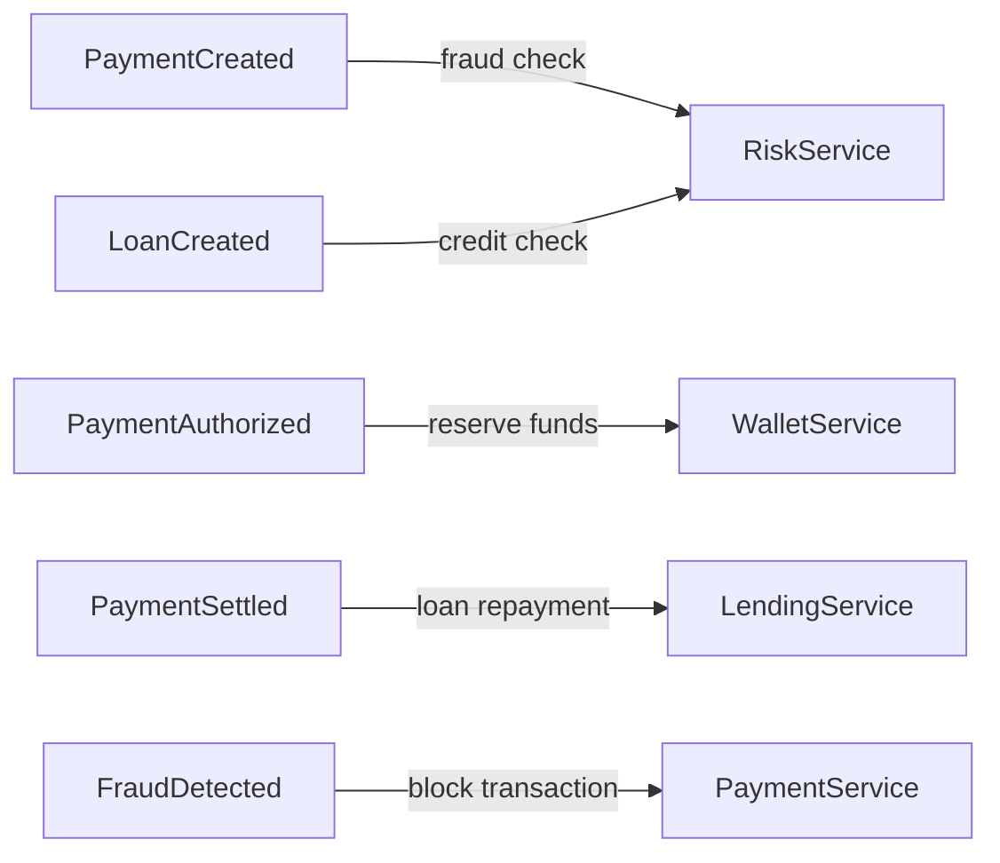
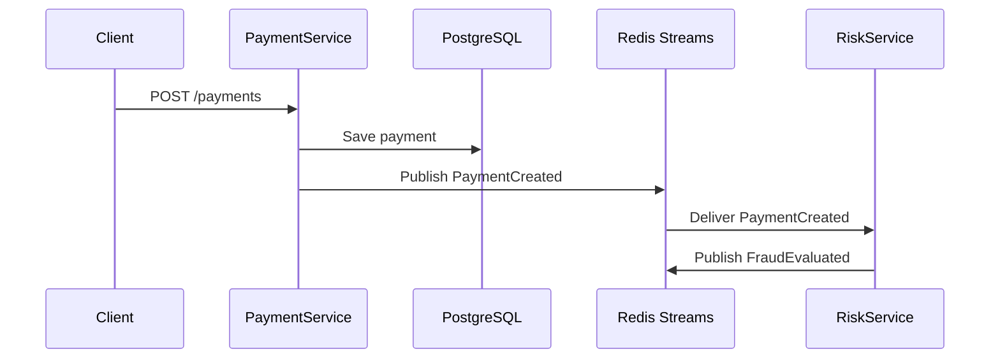
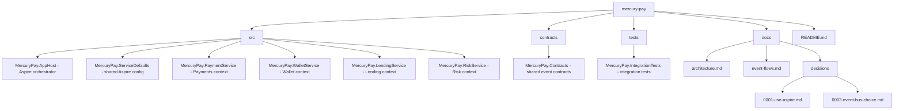

# MercuryPay

Intelligent financial orchestration platform for payments, wallets, lending, and risk — built with .NET Aspire as event-driven microservices.

## Quick Start

```bash
# Run the entire platform
dotnet run --project src/MercuryPay.AppHost

# Open Aspire Dashboard (auto-launches)
# https://localhost:17225
```

## Documentation

- [Project Requirements & Traceability Matrix](docs/Requirements.md)
- [Findings & Issue Tracking Backlog](docs/Findings-Backlog.md)
- [Payment Service Design](docs/PaymentService-Design.md)
- [Wallet Service Design](docs/WalletService-Design.md)
- [Commit Guidelines](docs/Commit-Guidelines.md)
- [Development Process](docs/Development-Process.md)
- [Trae Assistant Rules](project_rules.md)

## Contributing

Please read [CONTRIBUTING.md](CONTRIBUTING.md) for details on our code of conduct, and the process for submitting pull requests.
We enforce **Test-Driven Development (TDD)** and **Documentation-Driven Development**.

## Overview

MercuryPay is a cloud-native distributed platform that demonstrates:

- Payment processing and settlement
- Wallet and ledger management
- Loan lifecycle orchestration
- Event-driven communication via Redis Streams
- AI agents for fraud analysis and reconciliation
- Full observability through .NET Aspire

Think of it as a mini Stripe plus a lending workflow engine, orchestrated by Aspire.

## Why .NET Aspire?

Aspire provides:

- **Service orchestration** — Start all services with one command
- **Service discovery** — Services reference each other by logical name
- **Infrastructure wiring** — Redis, PostgreSQL, message brokers declared in code
- **Built-in observability** — Traces, metrics, and logs in the Aspire dashboard
- **Developer-time orchestration** — No Docker Compose or Kubernetes needed locally

## Architecture



## Domain Model (DDD)

### Bounded Contexts

| Context  | Aggregates                        |
|----------|-----------------------------------|
| Payments | Payment, Transaction, Settlement  |
| Wallet   | Wallet, Balance, Ledger           |
| Lending  | Loan, Collateral, Repayment       |
| Risk     | FraudCheck, RiskScore             |
| Agent    | FraudAgent, RetryAgent            |

## Microservices

| Service         | Responsibility                                      |
|-----------------|-----------------------------------------------------|
| PaymentService  | Payment creation, authorization, capture, settlement |
| WalletService   | Balance management, double-entry ledger             |
| LendingService  | Loan lifecycle, collateral, repayment schedules     |
| RiskService     | Fraud detection, risk scoring, policy enforcement   |

Each service:

- Owns its own database (database-per-service)
- Uses idempotency keys for safe retries
- Publishes domain events to Redis Streams
- Consumes events idempotently

## Event-Driven Design

### Domain Events



### Event Flow Example



## Distributed Patterns

| Pattern              | Implementation                                    |
|----------------------|---------------------------------------------------|
| Saga                 | Loan creation with compensating transactions      |
| Outbox               | Transactional event publishing                    |
| Idempotent Consumer  | Event ID deduplication per consumer               |
| Cache-Aside          | Redis for wallet balance hot reads                |

## Observability (Aspire Dashboard)

The Aspire dashboard provides:

- **Traces** — Distributed trace view across all services
- **Logs** — Structured logs with correlation IDs
- **Metrics** — Request latency, error rates, throughput
- **Resources** — Health status of all services and infrastructure

Access at `https://localhost:17225` when running.

## API Endpoints

| Service        | Endpoint                          | Description           |
|----------------|-----------------------------------|-----------------------|
| PaymentService | `POST /payments`                  | Create payment        |
| PaymentService | `GET /payments/{id}`              | Get payment status    |
| WalletService  | `GET /wallets/{userId}/balance`   | Get wallet balance    |
| LendingService | `POST /loans`                     | Create loan           |
| RiskService    | `GET /risk/transactions/{id}`     | Get risk evaluation   |

## Tech Stack

| Layer          | Technology                        |
|----------------|-----------------------------------|
| Orchestration  | .NET Aspire                       |
| Backend        | .NET 10, ASP.NET Core Minimal APIs|
| Messaging      | Redis Streams                     |
| Database       | PostgreSQL                        |
| Cache          | Redis                             |
| Observability  | OpenTelemetry (via Aspire)        |
| AI Agents      | Python / Semantic Kernel          |

## Project Structure



## Development

### Prerequisites

- .NET 10 SDK
- Docker (for Redis and PostgreSQL containers)

### Run Locally

```bash
# Start all services with Aspire
dotnet run --project src/MercuryPay.AppHost
```

Aspire will:

1. Start Redis and PostgreSQL containers
2. Launch all microservices
3. Open the Aspire dashboard

### Run Tests

```bash
dotnet test
```

## Security

- JWT authentication for API endpoints
- Service-to-service authentication via mTLS
- API key rotation
- Rate limiting at gateway level

## License

MIT
