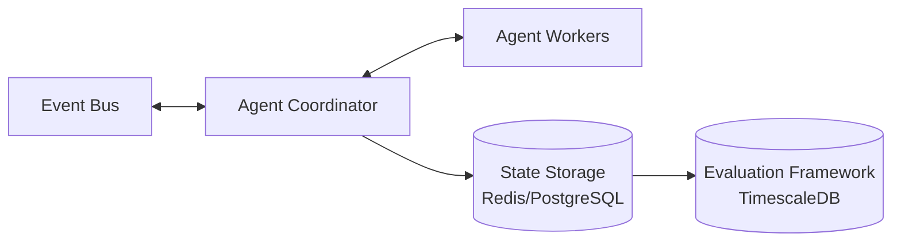

# Technical Requirements: Agent Platform

## 1. Overview

The Agent Platform is a core component of MercuryPay that hosts intelligent, autonomous agents responsible for monitoring system events, making decisions, and triggering actions. It satisfies the JD's requirements for **multi-agent AI systems**, **reliability patterns**, and **agent evaluation frameworks**. Agents collaborate to enhance system resilience, detect anomalies, and optimize operational costs.

### 1.1 Goals

- **Event-Driven** – Agents consume domain events and may publish commands or analysis results.
- **Reliable** – Agents handle failures with retries, circuit breakers, and fallback strategies.
- **Observable** – All agent actions are logged, traced, and evaluated for success rates and latency.
- **Evaluable** – A built-in framework tracks agent performance, enabling continuous improvement.
- **Secure** – Agents have restricted identities and scoped permissions.

### 1.2 Agents to Implement (Phase 1)

| Agent | Responsibility | Input Events | Output Events/Actions |
|-------|----------------|--------------|------------------------|
| **Fraud Detection Agent** | Analyze transactions for suspicious patterns; emit fraud alerts. | `PaymentInitiated`, `PaymentCaptureFailed`, `PaymentRiskAssessed` | `FraudDetected` |
| **Retry Agent** | Manage retries for failed operations (e.g., payment captures). | `PaymentCaptureFailed` | `RetryPaymentCommand`, escalate to `PaymentRequiresReview` |
| **Reconciliation Agent** | Ensure consistency between wallet balances and ledger entries. | `WalletCredited`, `WalletDebited`, `HoldPlaced`, `HoldReleased` | `ReconciliationReport`, `LedgerMismatch` |
| **Cost Optimization Agent** | Analyze infrastructure usage and suggest scaling or resource adjustments. | `AgentHeartbeat`, `ServiceMetrics` (via observability) | `ScaleRecommendation`, `CostAlert` |

---

## 2. Functional Requirements

### 2.1 Agent Platform Core Capabilities

#### 2.1.1 Agent Lifecycle Management

- **Registration** – Each agent registers its capabilities, input event types, and output event types.
- **Start/Stop** – Platform can start/stop agents gracefully.
- **Health Checks** – Agents expose heartbeat; platform monitors and restarts unhealthy agents.

#### 2.1.2 Event Subscription & Processing

- Agents subscribe to specific event types from the central event bus (Kafka/Redis Streams).
- Each agent processes events asynchronously.
- Events are delivered with at-least-once guarantees; agents must be idempotent.

#### 2.1.3 Coordination & Collaboration

- Agents can communicate via the event bus (publishing events).
- A shared context (e.g., in Redis) can be used for inter-agent state sharing (e.g., fraud confidence scores).
- A simple coordination layer (agent orchestrator) manages task delegation when multiple agents are involved (e.g., fraud agent consults risk service via agent orchestrator).

#### 2.1.4 Reliability Patterns

- **Retry Logic** – Configurable retry with exponential backoff for failed agent operations.
- **Circuit Breaker** – If an agent repeatedly fails, it is temporarily suspended.
- **Fallback** – Agents can invoke fallback actions (e.g., escalate to manual review).
- **Timeouts** – Long-running agent tasks are timed out; state saved for resumption.

### 2.2 Agent-Specific Requirements

#### Fraud Detection Agent

- Consumes `PaymentInitiated` events.
- Uses a rule engine + simple ML model (or external LLM) to assign risk score.
- If risk score > threshold, emits `FraudDetected` event.
- Optionally uses agent orchestrator to fetch additional data (e.g., from Risk Service).

#### Retry Agent

- Listens for `PaymentCaptureFailed` events.
- Maintains retry count per payment/capture attempt (in persistent storage).
- For retries: emits `RetryPaymentCommand` back to payment service after backoff.
- After max retries: emits `PaymentRequiresReview` and releases holds via wallet service.

#### Reconciliation Agent

- Periodically (or triggered) compares wallet balances with ledger entries.
- Uses a read model of `Wallet` and `LedgerEntry` (via read replicas).
- If mismatch found, emits `LedgerMismatch` with details.
- Can also trigger corrective commands (e.g., `AdjustBalanceCommand` with approval).

#### Cost Optimization Agent

- Consumes infrastructure metrics (CPU, memory, request rates) via observability APIs.
- Analyzes usage patterns; if thresholds exceeded, emits `ScaleRecommendation` (e.g., increase replicas, change instance size).
- Can also emit `CostAlert` for abnormal spending.

### 2.3 Agent Evaluation Framework

- **Metrics Logging** – For every agent action (task), log:
  - `taskId`
  - `agentType`
  - `startTime`, `endTime`, `duration`
  - `success` (boolean)
  - `error` (if any)
  - `inputEventId`
- **Success Rate Calculation** – Platform computes success rates per agent over time windows.
- **Anomaly Detection** – Detect when agent success rates drop below threshold; trigger alerts.
- **Feedback Loop** – Metrics are fed back to agents (e.g., via a shared store) so agents can adjust behavior (e.g., retry agent can learn optimal backoff based on historical success rates).
- **Dashboard** – Visualize agent performance (success rate, latency, events processed).

---

## 3. Non-Functional Requirements

### 3.1 Performance & Scalability

- Each agent must be horizontally scalable (stateless or with partitioned state).
- The agent platform must handle at least 10,000 events/second.
- Event processing latency per agent: < 500ms (p95) for simple agents; fraud agent may be slower due to ML inference.

### 3.2 Reliability

- Agents recover from crashes without data loss (persist state).
- Event processing is idempotent; duplicate events are ignored.
- Platform SLA: 99.9% availability.

### 3.3 Security

- Each agent has a unique identity (SPIFFE/Service Principal).
- Agents use mTLS for communication with event bus and other services.
- Agents have scoped permissions: can only publish specific event types and call allowed APIs.
- Secrets (e.g., LLM API keys) are stored in Azure Key Vault and rotated automatically.

### 3.4 Observability

- All agent actions emit OpenTelemetry spans (traces).
- Structured logs with correlation IDs (propagated from input events).
- Metrics exposed via Prometheus (e.g., `agent_tasks_total`, `agent_task_duration_seconds`).

---

## 4. Architecture & Technology Stack

### 4.1 High-Level Architecture

### 4.2 Technology Choices

- **Agent Implementation**: Python (for ML/LLM integration) or .NET (for tighter integration with other services). For simplicity, start with Python for all agents.
- **Agent Orchestration**: Custom lightweight coordinator using Kafka consumer groups. Alternatively, use a workflow engine like Temporal for complex agent workflows.
- **State Storage**: Redis for short-lived state (retry counters, circuit breaker state); PostgreSQL for persistent task history.
- **Event Bus**: Kafka (for high throughput, replay, and consumer group management) or Azure Event Hubs.
- **Evaluation Database**: TimescaleDB (time-series) for storing agent metrics.
- **ML/LLM**: For fraud detection, use a lightweight model (e.g., scikit-learn) or OpenAI API with careful cost controls. For cost optimization, use simple heuristics initially.
- **Containerization**: Docker; deployment on Kubernetes (AKS).

### 4.3 Agent Worker Design

Each agent type runs as a separate Kubernetes deployment (scalable). Workers use the same base library that provides:

- Event consumer (Kafka consumer group)
- Idempotency handling
- Retry/backoff logic
- Metrics emission

---

## 5. Integration Points

### 5.1 Event Bus

- Agents consume events from topics: `payment-events`, `wallet-events`, `lending-events`, `risk-events`, `agent-events`.
- Agents publish events to `agent-events` topic for coordination and also to service-specific topics (e.g., `payment-commands` for retry commands).

### 5.2 Services

- **Payment Service** – Receives `RetryPaymentCommand` via command topic.
- **Wallet Service** – May be called via API (if not event-driven) for hold releases after max retries.
- **Risk Service** – Fraud agent may query for additional data via API.

### 5.3 Observability

- OpenTelemetry collector to export traces/logs/metrics to Azure Monitor / Grafana.

### 5.4 Security Integration

- Azure Key Vault for API keys.
- Azure AD / managed identities for service-to-service auth.

---

## 6. Implementation Phases

### Phase 1: Foundation (2-3 weeks)

- Set up agent platform skeleton with event consumer library.
- Implement Retry Agent as first proof-of-concept.
- Add basic evaluation logging (store metrics to TimescaleDB).
- Create simple dashboard.

### Phase 2: Fraud & Reconciliation Agents (2 weeks)

- Implement Fraud Detection Agent with rule engine (initial heuristics).
- Implement Reconciliation Agent (periodic checks).
- Enhance evaluation framework with anomaly detection.

### Phase 3: Cost Optimization & Collaboration (2 weeks)

- Implement Cost Optimization Agent.
- Add agent coordination (e.g., fraud agent calls risk service).
- Complete evaluation dashboard.

### Phase 4: Reliability & Security Hardening (1 week)

- Add circuit breakers, retries, fallbacks.
- Integrate secret management.
- Final security review.

---

## 7. Acceptance Criteria

- [ ] All four agents are implemented and process events correctly.
- [ ] Agents survive failures and restart without data loss.
- [ ] Evaluation dashboard shows success rates, latency, and errors per agent.
- [ ] Anomaly detection triggers alerts when agent success rate drops below 95%.
- [ ] Agents have unique identities and only allowed permissions.
- [ ] System handles 10k events/second with <500ms p95 latency per agent.
- [ ] Documentation includes agent behavior, configuration, and troubleshooting guide.

---
