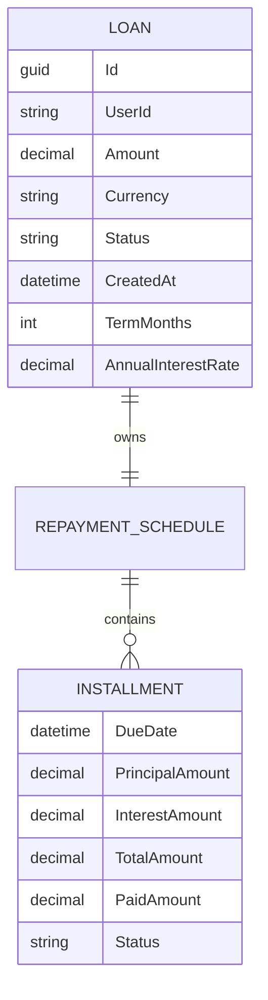
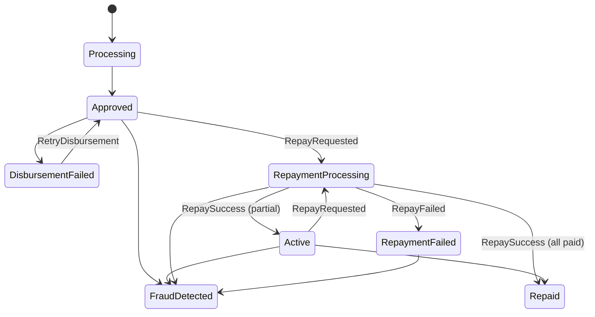
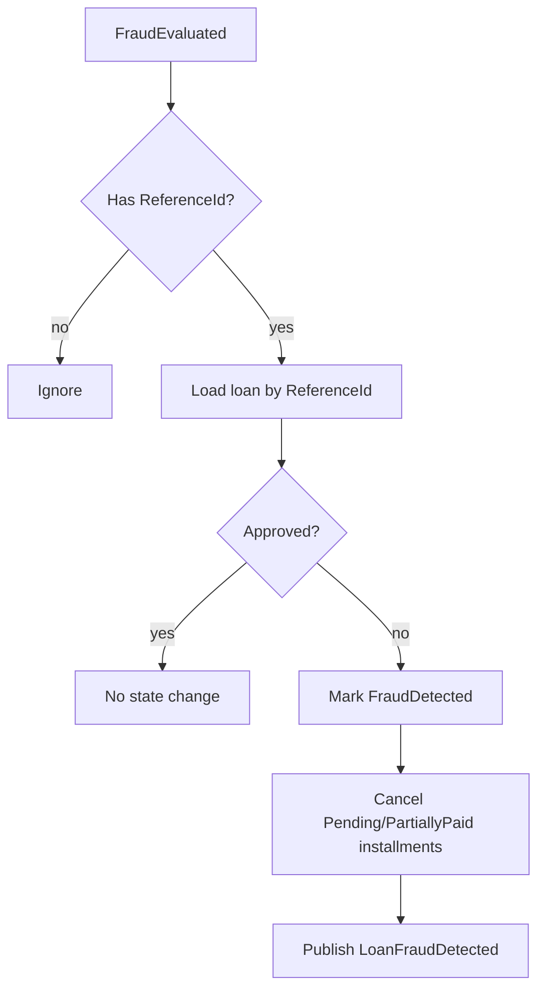

# Loan Lifecycle — Business Logic Specification

## 1. Purpose

Define and implement the Lending bounded context’s core loan lifecycle rules and workflows: loan origination, approval, disbursement handling, fraud handling, repayment initiation, repayment application, and terminal outcomes. This specification is written to be directly testable and aligns with Domain-Driven Design (DDD) boundaries.

## 2. Scope

### In scope
- Loan creation (`POST /loans`)
- Loan querying (`GET /loans`, `GET /loans/{id}`)
- Disbursement retry (`POST /loans/{id}/retry`)
- Repayment request (`POST /loans/{id}/repay`)
- Repayment processing (`LoanRepaymentProcessed` consumer)
- Fraud evaluation impact on loans (`FraudEvaluated` consumer)
- Repayment schedule generation rules
- Validation rules for all public operations
- State machine definitions and legal transitions
- Error scenarios and expected API responses
- Transaction handling requirements (EF Core + MassTransit outbox)

### Out of scope (for this iteration)
- Underwriting and credit scoring rules (beyond “auto-approve”)
- Interest rate products, promotions, variable rates, and compounding variants
- Collections, delinquency workflows, and legal enforcement
- Multi-currency FX conversions
- Refund handling for overpayments (tracked as a future enhancement)

## 3. Current Implementation Snapshot (as of latest main)

Primary artifacts:
- Domain: [Loan.cs](file:///Users/amir/Workspace/Dotnet/AspireApp/src/Services/LendingService/Domain/Loan.cs), [RepaymentSchedule.cs](file:///Users/amir/Workspace/Dotnet/AspireApp/src/Services/LendingService/Domain/RepaymentSchedule.cs), [Installment.cs](file:///Users/amir/Workspace/Dotnet/AspireApp/src/Services/LendingService/Domain/Installment.cs)
- Application service: [LendingService.cs](file:///Users/amir/Workspace/Dotnet/AspireApp/src/Services/LendingService/Services/LendingService.cs)
- API: [LoansController.cs](file:///Users/amir/Workspace/Dotnet/AspireApp/src/Services/LendingService/Controllers/LoansController.cs)
- Consumers: [LoanCreatedConsumer.cs](file:///Users/amir/Workspace/Dotnet/AspireApp/src/Services/LendingService/Consumers/LoanCreatedConsumer.cs), [LoanApprovedFaultConsumer.cs](file:///Users/amir/Workspace/Dotnet/AspireApp/src/Services/LendingService/Consumers/LoanApprovedFaultConsumer.cs), [LoanRepaymentProcessedConsumer.cs](file:///Users/amir/Workspace/Dotnet/AspireApp/src/Services/LendingService/Consumers/LoanRepaymentProcessedConsumer.cs), [FraudEvaluatedConsumer.cs](file:///Users/amir/Workspace/Dotnet/AspireApp/src/Services/LendingService/Consumers/FraudEvaluatedConsumer.cs)

Notable characteristics:
- Loan status is currently modeled as a `string`.
- Repayment schedule is generated at creation time.
- Repayment initiation publishes `LoanRepaymentRequested`; repayment application is done asynchronously upon `LoanRepaymentProcessed`.
- Fraud evaluation can mark loans as `FraudDetected` and cancel pending installments.

## 4. Domain Model (DDD)

### 4.1 Bounded context
- **Lending** owns Loan and its repayment schedule state.
- **Wallet** owns balances and transaction correctness (ledger).
- **Payment** coordinates movement-of-money for disbursement and repayment (as events).
- **Risk** (and agent platform) produce fraud signals.

Lending consumes external events (FraudEvaluated, LoanRepaymentProcessed) and publishes lending events (LoanCreated, LoanApproved, LoanFraudDetected, LoanRepaymentRequested).

### 4.2 Aggregates & entities

#### Aggregate: Loan (Aggregate Root)
- Identity: `Loan.Id`
- Invariants:
  - `Amount` must be `> 0` and `<= MaxLoanAmount`.
  - `Currency` must be non-empty and normalized to uppercase; inputs must be valid ISO 4217 codes for public APIs.
  - `AnnualInterestRate` is a fractional decimal in `(0, 1]` (e.g., `0.05` for 5%).
  - `TermMonths` must be in `[1, 120]`.
- Owned state:
  - `RepaymentSchedule` (owned) containing `Installment` (owned collection).

#### Entity: Installment (owned by Loan)
- Identity: implicit (index/order + due date) for MVP; no separate persistent ID required.
- State: `Pending`, `PartiallyPaid`, `Paid`, `Cancelled`.

### 4.3 Entity relationships (conceptual)



## 5. State Management

### 5.1 Loan status state machine

Loan status values (MVP):
- `Processing` — created, not yet approved.
- `Approved` — underwriting approved; disbursement should occur.
- `DisbursementFailed` — disbursement attempt failed; retry allowed.
- `FraudDetected` — fraud flagged; pending installments cancelled; loan blocked.
- `Active` — repayment schedule is live; at least one installment pending.
- `RepaymentProcessing` — repayment requested and awaiting external processing.
- `RepaymentFailed` — repayment attempt failed.
- `Repaid` — all installments paid.

Legal transitions:
- `Processing` → `Approved`
- `Approved` → `Active` (when disbursement success is confirmed; may be implicit in MVP)
- `Approved` → `DisbursementFailed`
- `DisbursementFailed` → `Approved` (via retry)
- `Approved|Active|RepaymentProcessing|RepaymentFailed` → `FraudDetected`
- `Approved|Active` → `RepaymentProcessing`
- `RepaymentProcessing` → `Active` (repayment success but not fully paid)
- `RepaymentProcessing` → `Repaid` (repayment success and fully paid)
- `RepaymentProcessing` → `RepaymentFailed` (repayment failure)
- `Active` → `Repaid` (when all installments become `Paid`)



### 5.2 Installment status rules
- `Pending` → `PartiallyPaid` when `PaidAmount` becomes `> 0` and `< TotalAmount`.
- `Pending|PartiallyPaid` → `Paid` when `PaidAmount` becomes `== TotalAmount`.
- `Pending|PartiallyPaid` → `Cancelled` when loan is marked fraud.
- `Paid` is terminal in MVP.

## 6. Business Rules & Validation

### 6.1 Loan origination (CreateLoan)
Input (API):
- `UserId` (may be derived from claims)
- `Amount`
- `Currency`
- `TermMonths`

Rules:
- Amount: `0 < amount <= 100000`.
- Term: `1 <= termMonths <= 120`.
- Currency: valid ISO 4217 code and normalized to uppercase.
- Loan starts in `Processing`, then emits `LoanCreated` for asynchronous approval.
- Repayment schedule is generated immediately using amortization formula.

Success criteria:
- Loan is persisted and queryable by ID.
- `LoanCreated` is published transactionally with DB save (outbox).
- Repayment schedule contains exactly `TermMonths` installments with due dates `CreatedAt + i months`.

Error scenarios:
- Invalid amount/term/currency → `400 Bad Request`.
- Unauthorized request → `401 Unauthorized`.

### 6.2 Approval (LoanCreatedConsumer)
Rules:
- On `LoanCreated`, find loan by ID.
- If not found due to race, throw to trigger retry.
- Approve the loan (`Processing` → `Approved`).
- Publish `LoanApproved` to trigger disbursement.

Success criteria:
- Loan status becomes `Approved`.
- `LoanApproved` is published.

### 6.3 Disbursement failure (LoanApprovedFaultConsumer)
Rules:
- On `Fault<LoanApproved>`, mark loan `DisbursementFailed`.

Success criteria:
- Loan status becomes `DisbursementFailed`.
- Retry endpoint is enabled only in this state.

### 6.4 Disbursement retry (RetryDisbursement)
Rules:
- Allowed only if loan status is `DisbursementFailed`.
- Transition back to `Approved` and publish `LoanApproved`.

Success criteria:
- Endpoint returns `202 Accepted`.
- Loan status transitions as defined.

Error scenarios:
- Loan not found → `400` (current behavior) or `404` (preferred future behavior; tracked).
- Invalid status → `400`.

### 6.5 Fraud evaluation (FraudEvaluatedConsumer)
Rules:
- If `ReferenceId` is present and maps to a loan:
  - If fraud not approved: set `FraudDetected` and cancel all `Pending|PartiallyPaid` installments.
  - Publish `LoanFraudDetected` for downstream awareness.

Success criteria:
- Status becomes `FraudDetected`.
- No further repayment requests are accepted while in `FraudDetected`.

### 6.6 Repayment request (RepayLoan)
Rules:
- Amount must be positive.
- Allowed only if status is `Approved` or `Active`.
- Set status to `RepaymentProcessing`.
- Publish `LoanRepaymentRequested(LoanId, UserId, Amount, Currency)`.
- Concurrency control: serialize repayment initiation per loan within a single process instance (MVP). Future: distributed locking/idempotency keys.

Success criteria:
- Endpoint returns `202 Accepted`.
- Status becomes `RepaymentProcessing`.
- A `LoanRepaymentRequested` event is published.

Error scenarios:
- Amount <= 0 → `400`.
- Loan missing or invalid status → `400` (current); may become `404/409` in future.

### 6.7 Repayment application (LoanRepaymentProcessedConsumer + Loan.ProcessRepayment)
Rules:
- If `Success=false`: mark loan as `RepaymentFailed`.
- If `Success=true`:
  - Apply payment across installments in due-date order.
  - For each installment:
    - Pay remaining due fully when possible; otherwise partial pay and stop.
  - If all installments `Paid` then status becomes `Repaid`, else `Active`.
- Overpayment is tolerated (extra amount is ignored in MVP). Future enhancement: track credit/refund.

Success criteria:
- Installment statuses and `PaidAmount` reflect the applied payment.
- Loan status becomes `Active` or `Repaid` deterministically.

## 7. Workflow Flowcharts

### 7.1 Origination → Approval → Disbursement

```mermaid
flowchart TD
  A[POST /loans] --> B{Validate input}
  B -- invalid --> X[400 Bad Request]
  B -- valid --> C[Persist Loan: Processing + schedule]
  C --> D[Publish LoanCreated via outbox]
  D --> E[LoanCreatedConsumer: Approve]
  E --> F[Publish LoanApproved]
  F --> G{Downstream disbursement succeeds?}
  G -- yes --> H[Loan becomes Active (future explicit event)]
  G -- no --> I[Fault&lt;LoanApproved&gt; => DisbursementFailed]
  I --> J[POST /loans/{id}/retry => Approved + publish LoanApproved]
```

### 7.2 Repayment

```mermaid
flowchart TD
  A[POST /loans/{id}/repay] --> B{Validate amount + state}
  B -- invalid --> X[400]
  B -- valid --> C[Set status RepaymentProcessing]
  C --> D[Publish LoanRepaymentRequested]
  D --> E[External processing (Wallet/Payment)]
  E --> F[LoanRepaymentProcessed Success/Fail]
  F -->|Fail| G[Mark RepaymentFailed]
  F -->|Success| H[Apply payment to installments]
  H --> I{All installments paid?}
  I -- yes --> J[Mark Repaid]
  I -- no --> K[Mark Active]
```

### 7.3 Fraud handling



## 8. Transaction Handling & Consistency

### 8.1 Persistence
- EF Core persists Loan aggregate and owned repayment schedule.

### 8.2 Messaging consistency
- Use MassTransit EF outbox where enabled so “persist + publish” is atomic for LoanCreated and other events.
- Consumers must be idempotent for duplicate deliveries (MVP: rely on MassTransit inbox/outbox where configured; future: explicit idempotency keys per command-like message).

### 8.3 Concurrency
- Repayment initiation is serialized per loan **within a single instance** using an in-memory gate for MVP.
- Future production requirement: distributed lock or optimistic concurrency token + idempotency key on repayment requests.

## 9. Error Handling Contracts

API response requirements (MVP):
- `401` for missing/invalid auth.
- `400` for invalid inputs or invalid state transitions (current pattern).
- `404` for missing loans is recommended, but if current code returns `400`, tests should reflect current behavior until changed deliberately.

Event processing:
- If a consumer cannot find a loan that should exist (race), it must throw to trigger retry.

## 10. Test Coverage Requirements

### 10.1 Domain unit tests (required)
- Repayment schedule generation invariants (count, due dates, positive amounts).
- Interest rate validation (fractional, bounded).
- Currency normalization.
- Fraud detection cancels pending installments.
- Repayment application across partial/full/multi-installment and overpayment.

### 10.2 Application/service tests (required)
- CreateLoan enforces amount/term/currency validation and publishes LoanCreated.
- RepayLoan allowed states only; sets `RepaymentProcessing` and publishes LoanRepaymentRequested.
- RetryDisbursement allowed only for DisbursementFailed.

### 10.3 Consumer tests (required)
- LoanCreatedConsumer approves loan and publishes LoanApproved.
- LoanApprovedFaultConsumer marks DisbursementFailed.
- LoanRepaymentProcessedConsumer updates loan on success/failure.
- FraudEvaluatedConsumer marks FraudDetected when not approved.

## 11. Acceptance Criteria (Definition of Done)
- All rules in Sections 6–9 are implemented and covered by tests.
- All new/updated tests pass in CI.
- Documentation for lending lifecycle is consistent with implementation.

